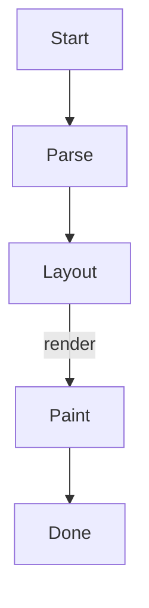

# example.md — a glance feature tour

A single file that exercises **every Markdown feature** glance renders. Open it with:

```sh
glance example.md
```

Then try `/` search, `o` for the table of contents, `f` for links, `c` to copy a code block,
`t` to flip the theme, and `q` to quit.

---

## 1. Headings

# H1 — the title
## H2 — a section
### H3 — a subsection
#### H4 — a sub-subsection
##### H5
###### H6

---

## 2. Text & emphasis

Plain text with **bold**, *italic*, ***bold italic***, ~~strikethrough~~, and `inline code`.

You can combine them: **bold with `code` inside**, or *italic with a [link](https://example.com)*.

A hard line break is two trailing spaces —  
this text is on the next line.

---

## 3. Lists

### Unordered (ul / li)

- First item
- Second item
  - Nested item
  - Another nested item
    - Even deeper
- Third item

### Ordered (ol)

1. Step one
2. Step two
   1. Sub-step a
   2. Sub-step b
3. Step three

### Task list

- [x] Write the parser
- [x] Add syntax highlighting
- [ ] Record the demo GIF
- [ ] Publish to crates.io

---

## 4. Blockquotes & GitHub callouts

> A normal blockquote.
> It can span multiple lines and contain **formatting**.

> [!NOTE]
> This is a note callout — glance renders GitHub's alert syntax.

> [!TIP]
> Press `h` at any time to see the full keybinding help.

> [!IMPORTANT]
> Config lives at `~/.config/glance/config.toml`.

> [!WARNING]
> Remote images require network access.

> [!CAUTION]
> This is the caution style.

---

## 5. Links

- Inline link: [glance on GitHub](https://github.com/sutharjay1/glance)
- Autolink: <https://www.rust-lang.org>
- Reference link: [the reference viewer][mdterm]
- A local link: [jump to the code section](#7-code-blocks)

[mdterm]: https://github.com/bahdotsh/mdterm

Press `f` to open the link picker, or click a link if your terminal supports it.

---

## 6. Images

Relative path (shows a placeholder until the file exists, then renders as half-blocks):


Remote image (fetched + decoded on a background thread — needs network):


---

## 7. Code blocks

Inline code: `let x = 42;` and a command like `cargo build --release`.

### Rust

```rust
fn main() {
    let greeting = "Hello, glance!";
    for (i, word) in greeting.split_whitespace().enumerate() {
        println!("{i}: {word}");
    }
}
```

### Python

```python
def fib(n: int) -> list[int]:
    """Return the first n Fibonacci numbers."""
    seq = [0, 1]
    while len(seq) < n:
        seq.append(seq[-1] + seq[-2])
    return seq[:n]

print(fib(10))
```

### JavaScript

```javascript
const items = [1, 2, 3, 4, 5];
const doubled = items.map((n) => n * 2).filter((n) => n > 4);
console.log(`doubled & filtered: ${doubled}`);
```

### HTML

```html
<!doctype html>
<html lang="en">
  <head>
    <meta charset="utf-8" />
    <title>Hello</title>
  </head>
  <body>
    <h1 class="title">Hello, world</h1>
  </body>
</html>
```

### CSS

```css
:root {
  --accent: #ff5800;
}

.title {
  color: var(--accent);
  font: 600 2rem/1.2 system-ui, sans-serif;
}
```

### Bash

```bash
#!/usr/bin/env bash
set -euo pipefail
for f in *.md; do
  echo "rendering $f"
  glance --pipe "$f" > "${f%.md}.txt"
done
```

### SQL

```sql
SELECT name, count(*) AS n
FROM events
WHERE created_at > now() - interval '7 days'
GROUP BY name
ORDER BY n DESC
LIMIT 10;
```

### JSON

```json
{
  "name": "glance",
  "version": "0.0.0",
  "features": ["streaming", "images", "math", "mermaid"],
  "fast": true
}
```

A fenced block with **no language** stays plain:

```
just some
preformatted text
```

---

## 8. Tables

| Feature        | mdterm | glance          |
| -------------- | :----: | --------------- |
| First paint    | 59 ms  | **1.7 ms**      |
| Binary size    | 9.0 MB | **4.3 MB**      |
| Streaming stdin|   ✗    | ✅ live          |
| Copy over SSH  |   ✗    | ✅ OSC 52        |

Alignment: left, `:---:` centered, and right-aligned columns are all supported.

---

## 9. Math (inline `$…$`)

Euler's identity: $e^{i\pi} + 1 = 0$. A sum: $\sum_{i=1}^{n} x_i^2$. Some relations:
$\alpha \leq \beta$, $x \neq y$, $a \times b$, and $\infty$ is unbounded.

Currency like $5 and $10 stays literal (not treated as math).

---

## 10. Mermaid diagram



---

## 11. Horizontal dividers

Three or more of `-`, `*`, or `_` on their own line:

---

***

___

---

## 12. Footnotes

Here is a statement with a footnote.[^1] And another one.[^note]

[^1]: This is the first footnote.
[^note]: Footnotes can contain **formatting** too.

---

## 13. Escapes & special characters

Escaped characters render literally: \*not italic\*, \`not code\`, \# not a heading.

Unicode is fine: café, naïve, 日本語, emoji 🚀 ✅ 🎉.

---

That's the tour. Everything above is rendered by glance in the terminal — scroll with `j`/`k`,
search with `/`, and quit with `q`.
